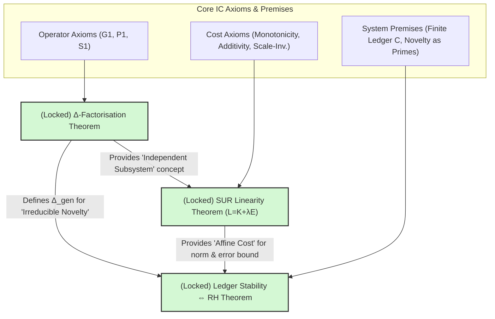

# Foundational Pillars of Informational Constructivism

**Version:** 1.1 

## 1. Introduction

Informational Constructivism (IC) is a theoretical framework aiming to derive the fundamental structures of reality from first principles of information processing under resource constraints. A significant milestone has been reached where key foundational theorems of IC are considered formally established *within its specific axiomatic framework*. These theorems provide a robust and internally consistent "locked slice" upon which further theoretical development and derivations (such as those targeting Quantum Mechanics, General Relativity, and fundamental physical constants) can securely build.

This document elaborates on these foundational pillars and their logical interdependencies:

1.  **The Δ-Factorisation Theorem:** Establishing a unique, minimal basis for all IC operations.
2.  **The Uniqueness of the Linear SUR Cost Functional (L = K + λE):** Defining the fundamental trade-off in resource-constrained information processing.
3.  **The Equivalence of Ledger Stability and the Riemann Hypothesis:** Linking the stability of finite-ledger information processing systems to deep structures in number theory.

Understanding these pillars and their precise logical connections is crucial for grasping the core logic, internal consistency, and predictive power of IC.

## 2. The Δ-Factorisation Theorem

*   **Core Document:** `01_Core_Axioms_and_Operators/IC_Delta_Factorisation.md`
*   **Theorem Statement (Informal):** Every admissible operation within IC can be uniquely decomposed into a canonical sequence involving at most one application each of the three primitive operators: `Δ_gen` (generation of novelty), `Δ_proj` (projection/compression to memory), and `Δ_self` (self-reference/internal model update), in a specific order.
*   **Formal Statement:** Every admissible IC operation `f` factors uniquely as `f = Δ_gen^g ∘ Δ_proj^p ∘ Δ_self^s`, where `g,p,s ∈ {0,1}`.

### Emphasis & Significance:

*   **Completeness:** The three primitive operators (`Δ_gen`, `Δ_proj`, `Δ_self`) are sufficient to describe any well-behaved, finite sequence of distinction-processing steps within IC. No other primitive operations are required at this fundamental level.
*   **Uniqueness:** Each distinct operational sequence reduces to one of only `2^3 = 8` canonical forms. This means there is no ambiguity in representing fundamental processes.
*   **Minimality:** The operator set `{Δ_gen, Δ_proj, Δ_self}` is a strict minimal basis. Any attempt to introduce a fourth "primitive" would either be reducible to a composition of these three (and thus not truly primitive) or would necessitate a change in IC's foundational axioms (G1, P1, S1).
*   **Operational Semantics Lockdown:** This theorem locks down the fundamental operational semantics of IC. It provides a clear, finite, and unambiguous alphabet of core actions.
*   **Foundation for Higher Structures:** This clear operational basis is essential for more complex constructions within IC, such as the categorical formulation (ΔCat) aiming to derive Hilbert Space structures. The idempotence of `Δ_proj` and the effective idempotence of `Δ_self` (in terms of its stabilized outcome) are critical here.

### Context of Rigor:

The proof detailed in `01_Core_Axioms_and_Operators/IC_Delta_Factorisation.md` relies on:
1.  The specific axiomatic definitions of `Δ_gen` (Axiom G1: Irreducibility), `Δ_proj` (Axiom P1: Idempotence), and `Δ_self` (Axiom S1: Contractivity leading to a unique fixed point).
2.  Standard term rewriting theory, demonstrating the existence of a factorization via well-founded induction, and uniqueness via the proof that the defined rewrite system is terminating and globally confluent (Church-Rosser property).
3.  The plausibility and formal correctness of commutation lemmas between the operators.

The status "locked foundation block" indicates that, given these IC-specific axioms and standard mathematical techniques, the theorem is considered rigorously proven.

## 3. The Uniqueness of the Linear SUR Cost Functional (L = K + λE)

*   **Core Documents:** `02_SUR_Dynamics_and_Cost/IC_SUR_Linearity_Proof.md`, `03_Derived_Structures_and_Connections/IC_RH_Connection.md` (Theorem 1)
*   **Theorem Statement:** Given a set of fundamental axioms for a cost functional `L(K,E)` (where `K` is descriptive/informational complexity and `E` represents other operational costs like energy or error), `L` must uniquely take the affine linear form `L = K + λE`, where `λ` is a positive constant.

### Axioms for Derivation:
1.  **Domain:** `L: ℝ_{≥0}^2 → ℝ_{≥0}` (costs are non-negative).
2.  **Monotonicity:** If `K₂ ≥ K₁` and `E₂ ≥ E₁`, then `L(K₂,E₂) ≥ L(K₁,E₁)`. (More complexity or more error never decreases cost).
3.  **Additivity for independent subsystems:** `L(K₁+K₂, E₁+E₂) = L(K₁,E₁) + L(K₂,E₂)`. (The cost of two separate, non-interacting things is the sum of their individual costs).
4.  **Scale-invariance of units:** For any `α > 0`, `L(αK, αE) = α L(K,E)`. (Changing the unit of measurement scales the cost proportionally).

### Emphasis & Significance:

*   **Unique Form:** The linear form is not an arbitrary choice but a necessary consequence of these foundational axioms about how cost behaves. This severely constrains the nature of optimization in SUR-systems.
*   **Fixed Trade-off Structure:** The relationship between informational complexity (K) and other operational costs (E) is fundamentally linear. This means there's a direct, constant rate of exchange.
*   **Single Exchange Rate (λ):** The entire trade-off is governed by a single parameter `λ`. IC further links this `λ` to fundamental thermodynamic costs (`k_B T ln 2` via Landauer's principle when considering physical information erasure), making informational costs directly commensurable with physical energy costs.
*   **Simplification of Optimization:** SUR dynamics, which posit that systems evolve to manage or minimize this cost `L`, become well-defined optimization problems (akin to Minimum Description Length principles penalized by `E`).
*   **Cornerstone for Further Derivations:** This linear form is a critical prerequisite for many other significant results in IC, including the derivation of the link between ledger stability and the Riemann Hypothesis, and the dimensional proof for `d_s=3`.

### Context of Rigor:

The proof is a standard mathematical derivation for functions satisfying Cauchy's functional equation, extended to two variables and constrained by monotonicity and scale invariance. Given the four axioms, the derivation of the linear form is mathematically rigorous. The "uniqueness" is strong *conditional upon these axioms accurately capturing the fundamental nature of cost in information-processing systems*.

## 4. The Equivalence of Ledger Stability and the Riemann Hypothesis

*   **Core Document:** `03_Derived_Structures_and_Connections/IC_RH_Connection.md` (Theorems 3A and 3B)
*   **Theorem Statement (Informal):** Within the framework of Informational Constructivism, the conditions required for a finite-ledger information-processing system to remain stable while processing irreducible novelty are mathematically equivalent to the conditions described by the Riemann Hypothesis (RH) concerning the distribution of prime numbers.
*   **Formal Statement:** Finite-ledger SUR stability ⇔ Riemann Hypothesis true.

### Logical Chain Summary:
1.  **Linear SUR Cost (L = K + λE):** This is the starting point (established above).
2.  **Unique Exponential Norm:** An additive cost `L(m)` for a structure `m` uniquely maps to a multiplicative norm `|m| := exp[L(m)]`.
3.  **Partition Function as ζ(s):** The partition function over all composite structures formed from irreducible distinctions (identified with prime numbers, `p`, whose costs `L(p)` are related to `log p` or `p^c`) naturally takes the form of the Riemann zeta function `ζ(s) = Π_p (1 - |p|⁻ˢ)⁻¹`.
4.  **Finite-Ledger Stability Conditions:** A finite-ledger observer (constrained by capacity `C`) must be able to stably represent these irreducible distinctions (primes).
    *   **Lemma A (Over-compression/Irreducibility Violation):** If primes were *more regular* than RH predicts (i.e., the error term `π(x) - Li(x)` is significantly smaller than `O(x^(1/2))`), the observer could compress them beyond their presumed irreducibility. This would violate a core IC tenet that `Δ_gen` introduces *truly irreducible* distinctions (Axiom G1).
    *   **Lemma B (Ledger Blow-up/Resolution Failure):** If primes were *more chaotic/erratic* than RH predicts (i.e., the error term is significantly larger than `O(x^(1/2))`), the descriptive complexity `K` required to track and distinguish these primes would grow too rapidly, eventually exceeding the finite ledger capacity `C`.
5.  **Critical Noise Criterion:** For stable operation, the prime distribution must adhere to a "critical" balance, where the error term is bounded as `|π(x) - Li(x)| = O(x^(1/2+ε))` for any `ε > 0`.
6.  **Mathematical Equivalence to RH:** This specific error bound is known in analytic number theory to be equivalent to the Riemann Hypothesis.

### Emphasis & Significance:

*   **Information-Theoretic Perspective on RH:** This result reframes the Riemann Hypothesis not merely as a mathematical conjecture about number theory, but as a fundamental condition for the possibility of stable, resource-constrained, information-processing systems capable of registering and integrating novelty.
*   **Deep Connection between Physics and Mathematics:** It suggests that the statistical properties of fundamental "building blocks" of information (primes, as analogues for irreducible novelty) are deeply intertwined with the operational constraints of any observer.
*   **Falsifiability and Predictive Power:** If RH were proven false in a way that violated the derived `O(x^(1/2+ε))` bound, IC would predict that stable finite-ledger systems as defined would be impossible. Conversely, IC provides a physical/informational *reason* why RH *should* be true.
*   **Guidance for Understanding Novelty:** It implies that the "noise floor" of reality (the arrival of irreducible distinctions) is critically tuned – not too predictable, not too chaotic – for stable structure formation and observation.

### Context of Rigor:

The rigor of this equivalence rests on several points:
1.  The robustness of the linear SUR cost functional.
2.  The mathematical steps mapping this cost to the `ζ(s)` function via the exponential norm and partition function formalism are standard, given appropriate definitions for the cost of irreducibles.
3.  The mathematical equivalence of the prime error term bound to RH is a well-established result in number theory.
4.  The core IC-specific contribution to rigor lies in the arguments for **Lemmas A and B**: that violations of the `O(x^(1/2+ε))` error bound *necessarily* lead to the described fundamental failures (G1 violation due to over-compression, or ledger capacity overflow) for *any system adhering to IC's axioms of finite-ledger processing and irreducible novelty generation*. These lemmas articulate why, from an IC perspective, the mathematical condition imposed by RH is also a condition for physical/informational viability.

This makes the equivalence a powerful *conditional* result: *if* IC's model of a stable, finite-resource information-processing system grappling with irreducible novelty is a correct description of aspects of reality, *then* the statistical nature of that novelty must conform to what RH describes.

## 5. Logical Interdependencies of the Foundational Pillars

The three locked theorems—Δ-Factorisation, SUR linearity, and ledger-stability⇔RH—are not isolated results but form a logically interconnected structure.

These foundational pillars provide the framework for understanding how an IC observer processes information. The Generative Path Space (GPS) (see 00_Introduction_and_Overview/GenerativePathSpace.md) represents the multitude of constructive ways an observer might arrive at a given state or structure.

The Δ-Factorisation Theorem defines the unique, primitive operational steps that constitute any path within the GPS.

The SUR Linearity Theorem (L=K+λE) establishes the fundamental cost associated with traversing paths in the GPS, guiding the observer's selections and optimizations.

The Ledger Stability ⇔ RH Theorem demonstrates how the ability to stably process the GPS of novel, irreducible inputs (modeled as primes) is linked to deep mathematical regularities, ensuring the GPS itself doesn't become unmanageably chaotic or trivially predictable.
